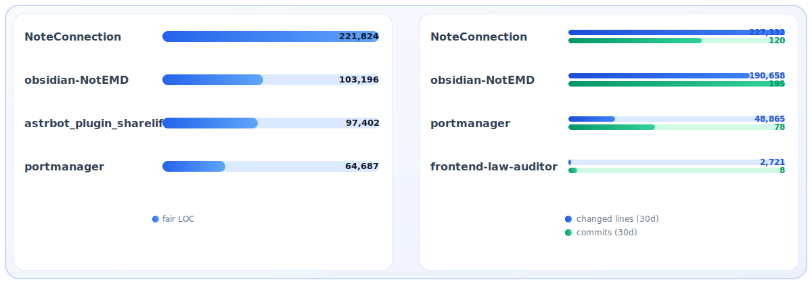

# 👋 Hi there, I'm Jacobinwwey

🎓 Ph.D. in Polymer Physics | Ultra-stable glass and photoresist research   

🧠 Passionate about **Mysterious** and **wonderful** scientific research, **interesting** applications of LLMs, and open-source work dedicated to enabling all to step into the halls of **desired learning**

---

## 📈 GitHub Stats

  

  
   
  
  

---

## 📫 How to reach me

- Email: `jacob.hxx.cn@outlook.com`  
- GitHub: [@Jacobinwwey](https://github.com/Jacobinwwey)
- Sponsor: [☕️ Buy Me a Coffee on Ko-fi](https://ko-fi.com/jacobinwwey)
- bilibili: [@Scripts and tutorials](https://space.bilibili.com/11159838/upload/video)

---

Thanks for visiting! 😊

 
